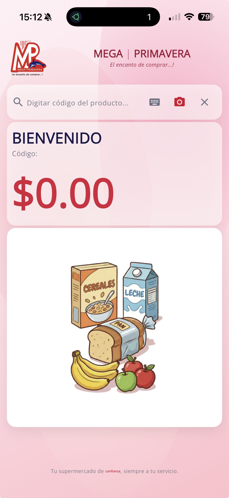
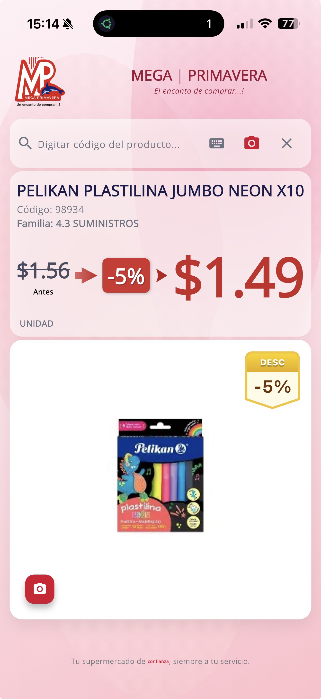
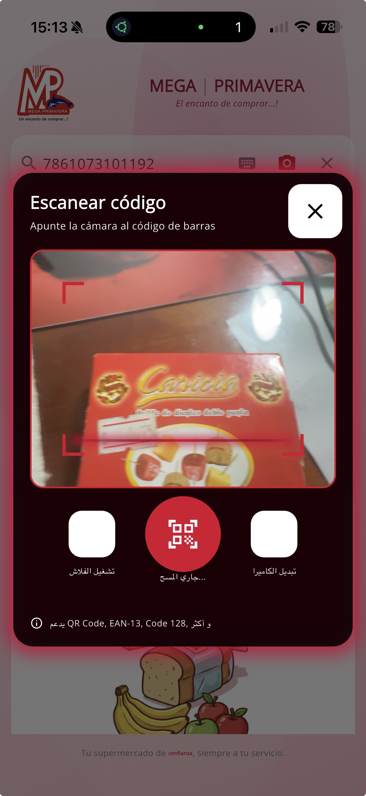
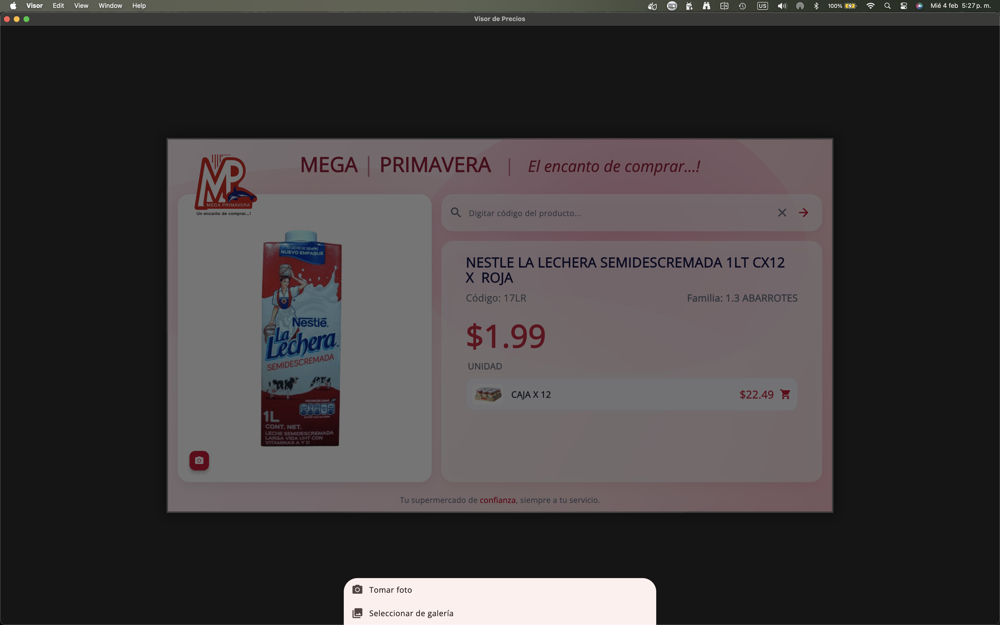

# TheosVisor - Visor de Precios

Aplicación multiplataforma para consulta de precios en establecimientos Mega Primavera. Permite buscar productos por código de barras o texto, visualizar precios, descuentos y presentaciones, así como gestionar imágenes publicitarias.

## Descargas

[](https://github.com/huntergps/visor/releases)

| Plataforma | Descarga | Notas |
|------------|----------|-------|
| Windows | [visor-windows-v1.0.0.zip](https://github.com/huntergps/visor/releases/tag/v1.0.0) | Incluye VC++ Runtime |
| Android | [app-release.apk](https://github.com/huntergps/visor/releases/tag/v1.0.0-android) | Instalación directa (sideload) |
| macOS | [TheosVisor-1.0.0-macos.dmg](https://github.com/huntergps/visor/releases/tag/v1.0.0-macos) | Firmado y notarizado por Apple |
| iOS | TestFlight | Solicitar invitación al administrador |

[Ver todas las versiones](https://github.com/huntergps/visor/releases)

## Manual de Usuario

Consulta el [Manual de Usuario](docs/MANUAL_USUARIO.md) para instrucciones detalladas de instalación, uso y solución de problemas.

## Características

- **Búsqueda de productos** - Por código de barras, código interno o texto
- **Escáner de códigos de barras** - EAN-13, EAN-8, UPC, Code 128, Code 39 y más
- **Visualización de precios** - Precios regulares, descuentos y precio final
- **Presentaciones** - Muestra otras presentaciones del mismo producto
- **Imágenes publicitarias** - Carrusel automático de imágenes del servidor
- **Editor de imágenes** - Captura, recorta y sube fotos de productos (con autenticación)
- **Caché inteligente** - Almacenamiento local de imágenes para mejor rendimiento
- **Multiplataforma** - Windows, macOS, Android, iOS
- **Configuración flexible** - URL del servidor, API key, tiempos y estilos personalizables

## Capturas de Pantalla

<p align="center">
  
  
  
</p>

<p align="center">
  
</p>

## Requisitos

### Para usuarios
- **Windows**: Windows 10 o superior (x64)
- **macOS**: macOS 10.14 (Mojave) o superior
- **Android**: Android 5.0 (API 21) o superior
- **iOS**: iOS 13.0 o superior
- Conexión a red local para consultar el servidor ERP

### Para desarrolladores
- Flutter SDK 3.10.3 o superior
- Dart SDK 3.0 o superior

## Instalación para Desarrollo

1. Clona el repositorio:
```bash
git clone https://github.com/huntergps/visor.git
cd visor
```

2. Instala las dependencias:
```bash
flutter pub get
```

3. Configura el archivo `.env` con las credenciales de la API:
```env
API_URL=tu_url_api
API_KEY=tu_api_key
```

4. Ejecuta la aplicación:
```bash
flutter run
```

## Compilación

### Windows
```bash
flutter build windows --release
```

### macOS (firmado + notarizado)
```bash
flutter build macos --release
# Firmar con Developer ID:
codesign --force --sign "HASH_CERTIFICADO" --entitlements macos/Runner/Release.entitlements --options runtime build/macos/Build/Products/Release/Visor.app
# Crear DMG, notarizar y grapar:
xcrun notarytool submit archivo.dmg --keychain-profile "notarytool-profile" --wait
xcrun stapler staple archivo.dmg
```

### Android (APK firmado)
```bash
flutter build apk --release
```

### Android (AAB para Play Store)
```bash
flutter build appbundle --release
```

### iOS (TestFlight)
```bash
flutter build ipa --release
xcrun altool --upload-app --type ios -f build/ios/ipa/*.ipa --username "tu_apple_id" --password "tu_app_specific_password"
```

## Publicar Release (Windows)

Scripts automatizados para compilar y publicar en GitHub:

```bash
./scripts/release.sh           # Usa versión del pubspec.yaml
./scripts/release.sh 1.0.1     # Especifica versión
```

```powershell
.\scripts\release.ps1                    # Usa versión del pubspec.yaml
.\scripts\release.ps1 -Version "1.0.1"   # Especifica versión
```

## Privacidad

[Política de Privacidad](https://galapagos.tech/theosvisor-privacidad)

## Licencia

Este proyecto es software propietario. Todos los derechos reservados.

## Soporte

- **Web:** [galapagos.tech](https://galapagos.tech)
- **Email:** info@galapagos.tech
- **Issues:** [GitHub Issues](https://github.com/huntergps/visor/issues)
